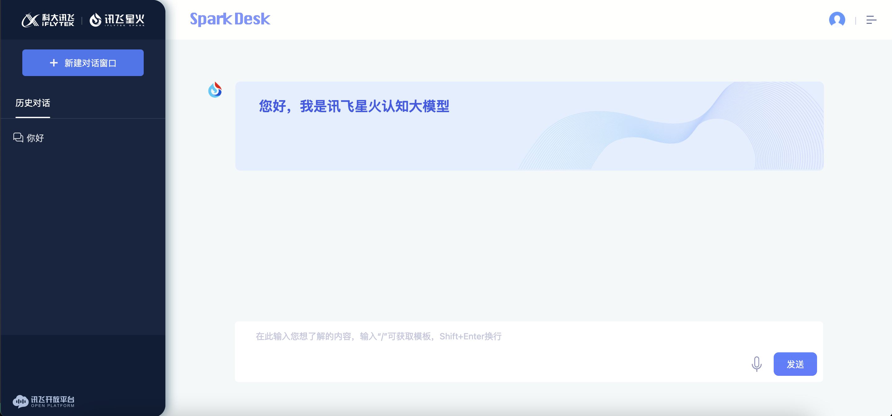

## 简介

- 喜欢这个插件的小伙伴，可以给我的GITHUB项目 [KeepXFXingHuo](https://github.com/xcanwin/KeepXFXingHuo) 点个⭐️STAR支持一下。
- 这是一款体验优化插件，沉浸式体验科大讯飞的星火认知大模型。
- 支持国产，感觉讯飞星火体验还不错，智商在线。

## 展示

</img>

## 用法

1. 浏览器首选```Chrome```、```Firefox```、```Edge```，其他主流浏览器都是主动兼容这3个浏览器的；
2. 安装```Tampermonkey```浏览器拓展，可以从 [Tampermonkey官网](https://www.tampermonkey.net/) 安装；
3. 安装```KeepXFXingHuo```插件，可以从 [安装渠道](#安装渠道) 选一个渠道安装；
4. 打开 [讯飞星火](https://xinghuo.xfyun.cn/desk) 尽情享用吧；

## 安装渠道

| 序号 | UserScript源 |
| --- | --- |
| 1 | [Github](https://raw.githubusercontent.com/xcanwin/KeepXFXingHuo/main/KeepXFXingHuo.user.js) |
| 2 | [GreasyFork](https://greasyfork.org/zh-CN/scripts/465794-keepxfxinghuo) |
